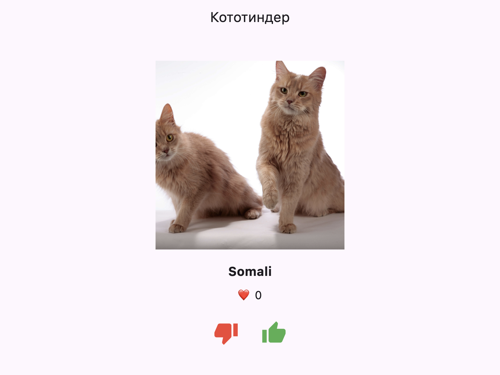
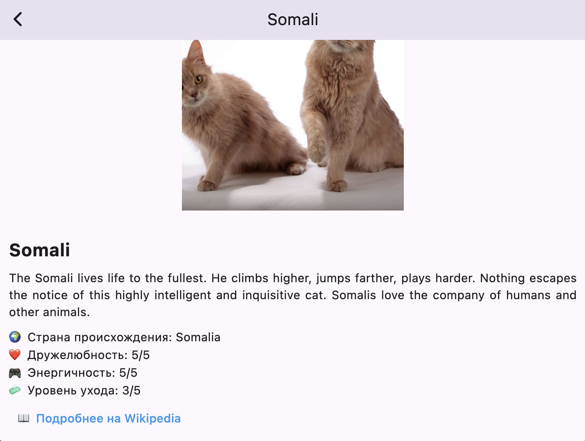
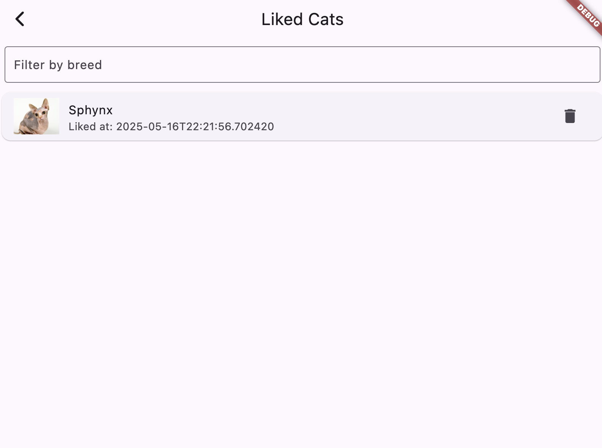

# 🐱 Кототиндер – Tinder для котиков

📱 **Flutter-приложение для просмотра случайных котиков с TheCatAPI**.  
Вы можете **свайпать**, **лайкать** котиков, а также смотреть **детальную информацию о породе**.

---

## 🚀 **Функции приложения**
✅ Отображение случайного изображения котика и названия его породы  
✅ **Свайп влево/вправо** или кнопки **лайк/дизлайк** меняют котика  
✅ Подсчет **количества лайков**  
✅ **Клик по изображению** открывает экран с подробной информацией  
✅ Экран **детального описания** содержит:  
   - Фото котика  
   - Описание породы  
   - Страну происхождения  
   - Оценки дружелюбности, энергии и ухода  
   - Ссылку на Wikipedia 📝
✅ Отображение ошибки при потере сети (`AlertDialog`)  
✅ Экран со списком лайкнутых котиков  
✅ Удаление лайков  
✅ Фильтрация по породе (поиск в текстовом поле)  
✅ Переиспользование лайков через BLoC  
✅ Загрузка кота = `CircularProgressIndicator`

---

## 🧱 Архитектура проекта

- Чёткое разделение на слои:
  - `data`: модели и API
  - `domain`: абстракции репозиториев
  - `presentation`: экраны, блоки, виджеты
- Состояние: `flutter_bloc`
- Внедрение зависимостей: `get_it`

---

## 🎨 **Скриншоты приложения**

| Главный экран | Экран деталей | Экран лайков |
|---------------|---------------| ------------ |
|  |  |  |

---

## 📥 **Скачать APK**
🔗 **[Скачать актуальную версию APK](https://disk.yandex.ru/d/Lf-XLAjgoagVgA)**
